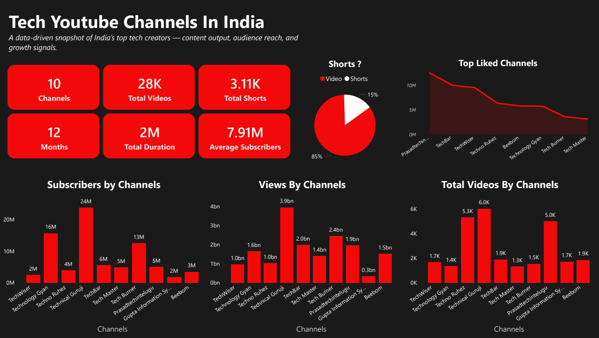
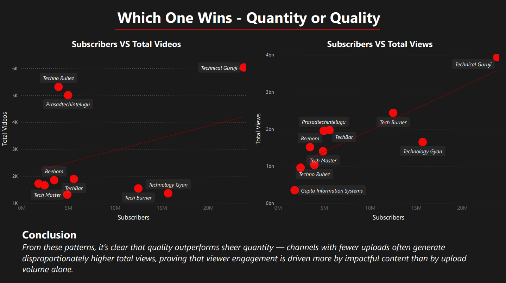
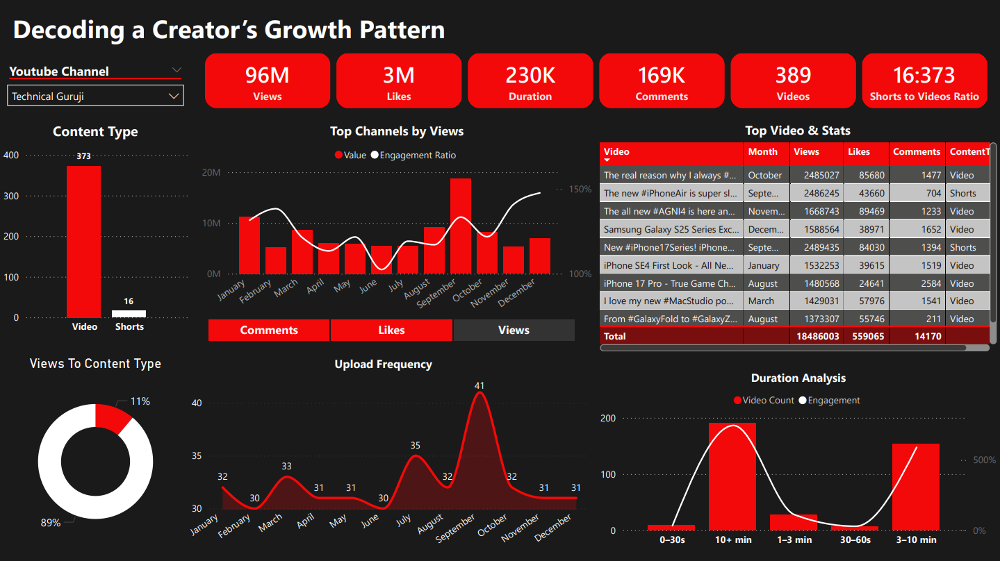
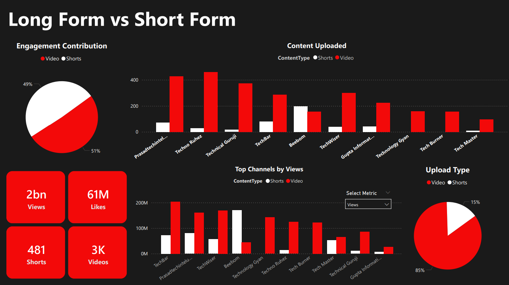
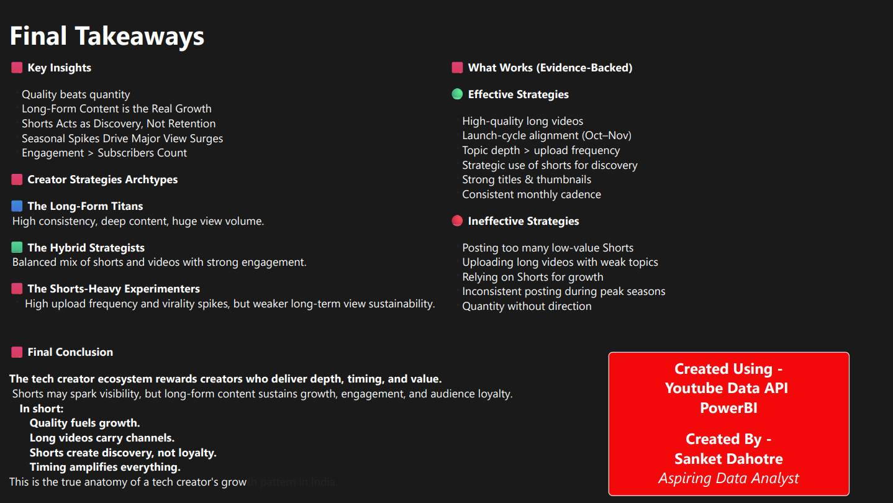

# 📊 Power BI Dashboard — Tech YouTube Channels Analytics

This Power BI dashboard visualizes 12 months of YouTube data from India's top tech creators.  
It transforms raw API data into insights about content strategy, engagement behavior, and creator growth patterns.

---

## 🚀 What This Dashboard Does

- Analyzes **28K+ long videos** & **3.1K shorts**
- Compares **long-form vs short-form** performance
- Reveals **upload frequency**, **duration trends**, and **seasonal spikes**
- Highlights **top-performing creators** based on views, likes, comments
- Maps **creator strategy archetypes** based on actual data
- Provides **KPI-driven insights** for fast decision-making

---

## 📸 Dashboard Preview

### 🔹 Overview

### 🔹 Quantity vs Quality

### 🔹 Creator Deep Dive

### 🔹 Engagement Breakdown

### 🔹 Final Insights Summary

## 🛠️ Power BI Work Done

### ✔ Data Modeling  
- Star schema linking channels, videos, and monthly stats  
- Relationship design using `channelId`, `videoId`, and timestamps  
- Calculated tables for duration buckets & monthly summaries  

### ✔ DAX Measures  
Custom measures built for:  
- Engagement Ratio  
- Views per Minute  
- Shorts-to-Videos Ratio  
- Views-to-ContentType  
- Upload Frequency  
- Long-form vs Shorts Contribution  

### ✔ Dashboard Features  
- Interactive slicers  
- KPI cards  
- Drill-down charts  
- Cross-filtering for channels & content types  
- Clean, UX-focused layout  

---

## 📈 Key Insights Unlocked

- **Quality > Quantity** — fewer strong uploads outperform high-volume channels  
- **Long videos drive 85–90% of total views**, shorts drive discovery  
- **Peak months** (Sep–Nov) show major spikes due to tech launches  
- **Engagement doesn’t scale with subscribers** — smaller channels often outperform  
- **Channel clusters** naturally form:  
  - Long-form Titans  
  - Hybrid Strategists  
  - Shorts-Heavy Experimenters  

---

## 🧰 Tech Used

- **Power BI Desktop**  
- **YouTube Data API v3**  
- **Python (Pandas, NumPy)**  
- **DAX + Data Modeling**  

---

## 📂 Files Included

- dashboard.pbix
- report.pdf
- data/
- notebooks/
- images/
- README.md
